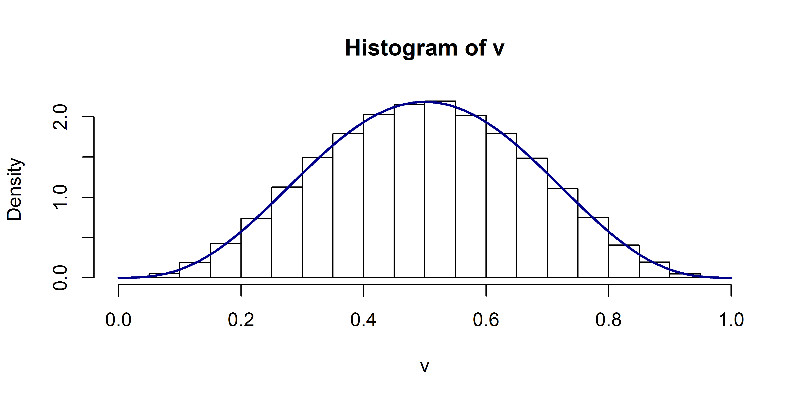
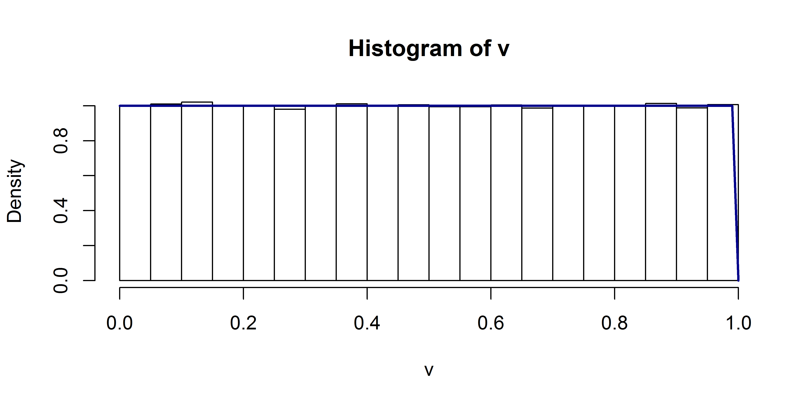
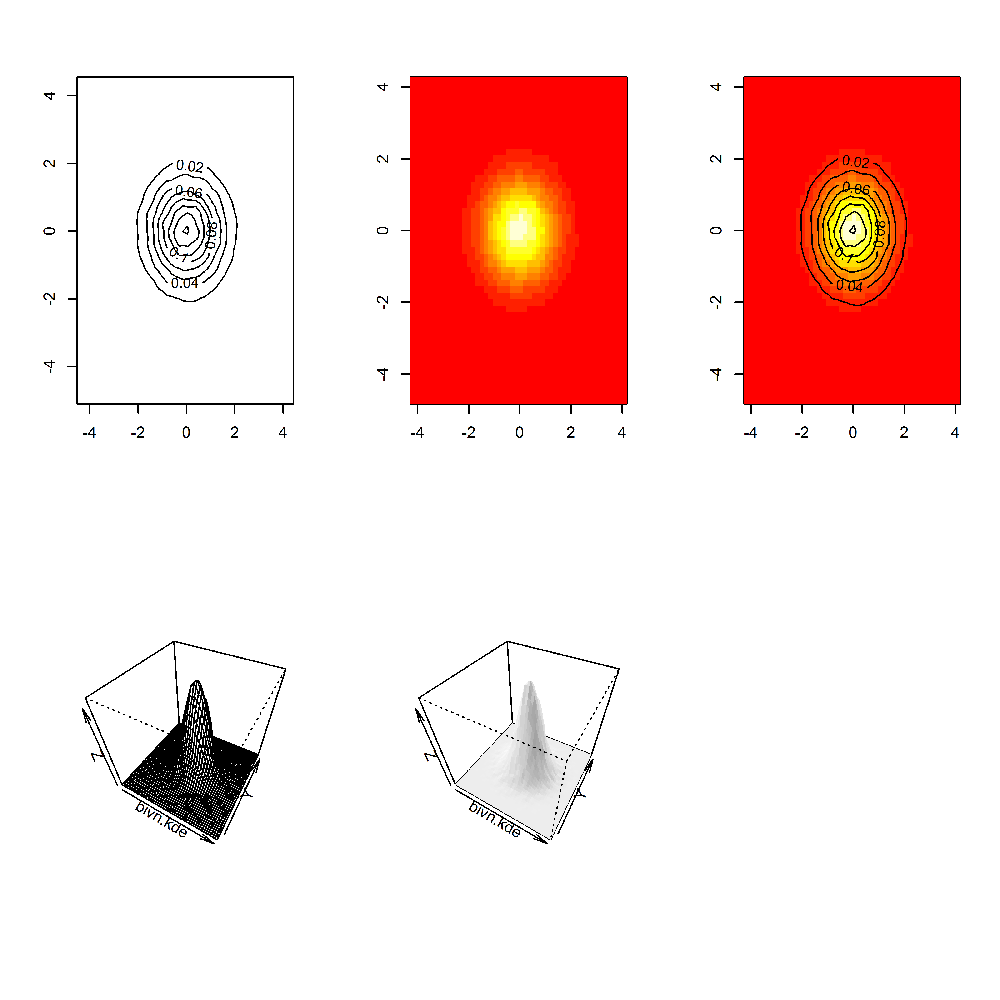
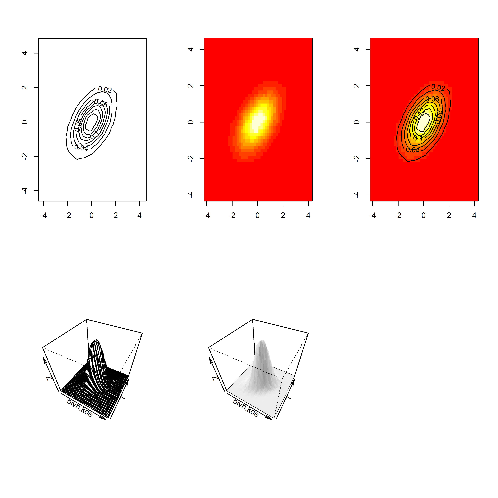
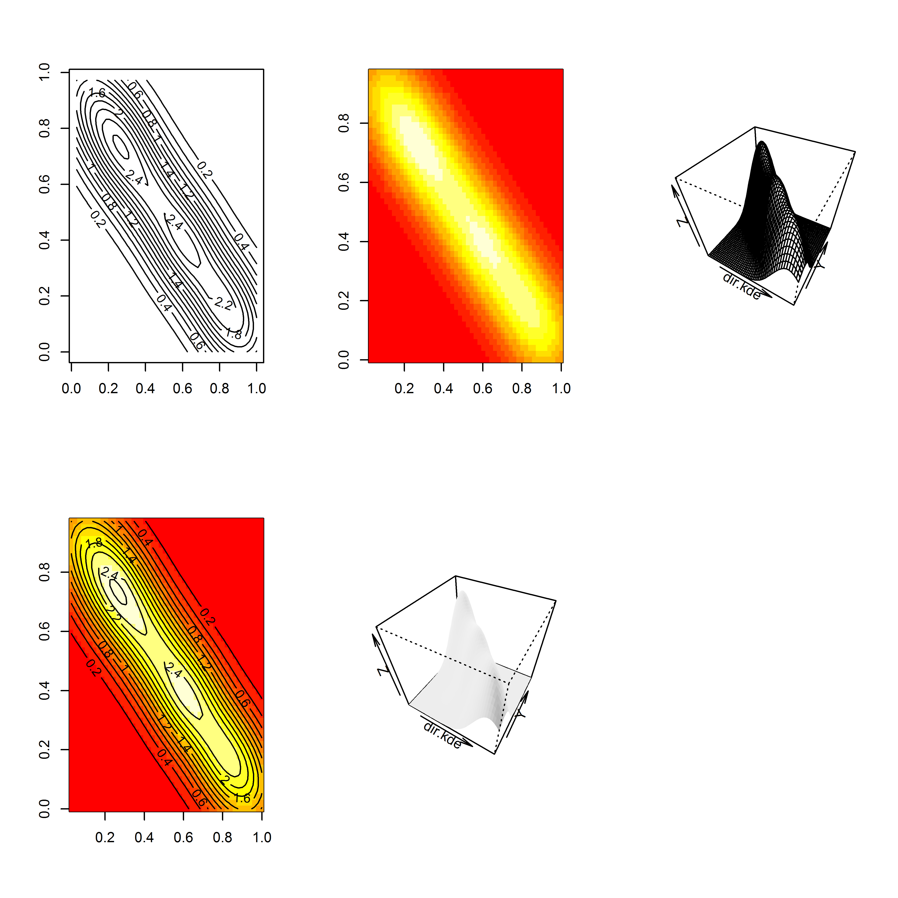
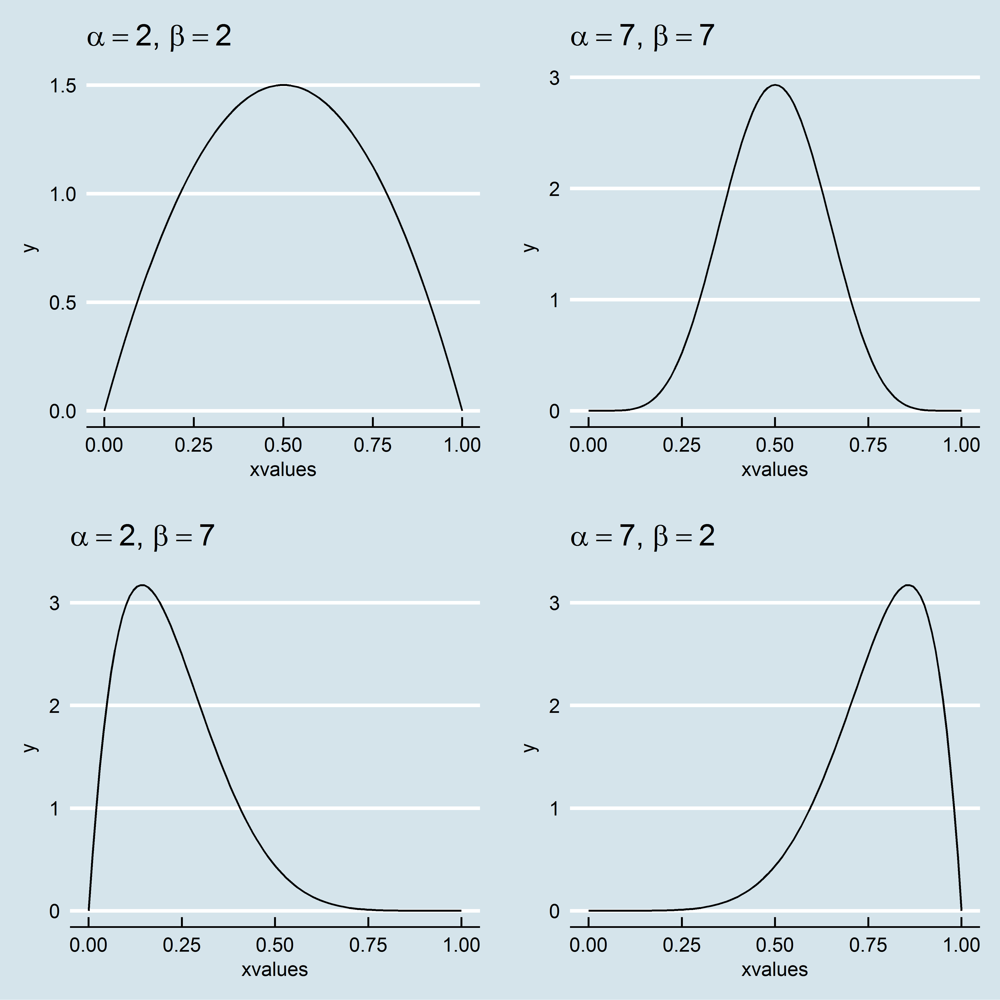
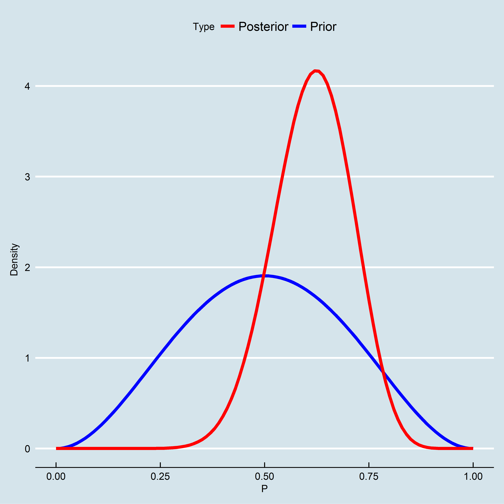

# Introdução

Este artigo tem por objetivo introduzir ao leitor o método involutivo vertical com o auxílio da ferramenta estatística **R** versão 3.4.3 para efetuar simulações de Monte Carlo.

Este artigo em conjunto com todos os seus códigos encontra-se disponível online[^1]. O relatório foi parametrizado de modo que qualquer pessoa pode alterar os parâmetros iniciais para fazer avaliações pelo método involutivo utilizando Simulação de Monte Carlo.

Para termos de *benchmark*, foi reproduzido o exemplo obtido em [@hoccheim2, p.65-68].

# Revisão bibliográfica

## Geração de variáveis (pseudo) aleatórias univariadas

### Semente

A utilização de algoritmos geradores de números pseudo-aleatórios, i.e, números gerados de acordo com um algoritmo que, partindo de um determinada semente (ou ponto inicial), sempre irá gerar os mesmos números aleatórios, permite a reproducibilidade da análise feita pelo pesquisador, conferindo assim uma maior credibilidade ao trabalho apresentado, haja vista que este pode ter seu código divulgado e reproduzido por quem deseje, dando inclusive a possibilidade de terceiros proporem alterações no algoritmo de forma a obter outros resultados.

Por isto este trabalho encontra-se hospedado em um repositório `git`, onde pode ser acessado e lido (através do arquivo `artigo.md`), podem ser feitas  recomendações de melhorias ou alterações no código por quem quer que seja, através da aba [Pull requests](https://github.com/lfpdroubi/involutivo_vertical/pulls), que posteriormente podem ser aceitas ou descartadas pelo administrador do repositório, ou comunicados problemas técnicos com o algoritmo, através da comunicação de problemas pela aba [Issues](https://github.com/lfpdroubi/involutivo_vertical/issues), além de diversas outras funcionalidades.

[^1]: [https://github.com/lfpdroubi/involutivo_vertical](https://github.com/lfpdroubi/involutivo_vertical)


```r
set.seed(1)
```

O **R** possui uma série de funções para a geração randômica de variáveis, entre as quais destacamos a função `runif`, para geração de uma variável uniforme, `rnorm`, para geração de uma variável normal, `rbeta`, para geração de uma variável com distribuição beta e muitas outras (`rt`, `rchisq`, `rbinom`).

\newpage

### Distribuição uniforme

Abaixo mostramos como gerar 10^5 números aleatórios, armazenando-os na variável `v`, e criar um histograma desta variável comparada com a curva de distribuição teórica:


```r
v <- runif(10^5)
hist(v, freq = FALSE)
curve(dunif(x),
          col="darkblue", lwd=2, add=TRUE, yaxt="n")
```

<div class="figure" style="text-align: center">

<p class="caption">Simulação de variável com distribuição uniforme</p>
</div>

### Distribuição normal

O mesmo procedimento pode ser feito para a distribuição normal, onde deve-se definir uma valor para a média (`mean = 10`) e o desvio-padrão (`sd = 2`) dos dados simulados.


```r
v <- rnorm(10^5, mean = 10, sd = 2)
hist(v, freq = FALSE)
curve(dnorm(x, mean = 10, sd = 2), 
          col="darkblue", lwd=2, add=TRUE, yaxt="n")
```

<div class="figure" style="text-align: center">

<p class="caption">Simulação de variável com distribuição normal</p>
</div>

### Distribuição beta

Para a geração de variáveis com distribuição beta, basta informa os parâmetros de forma da mesma, através dos argumentos `shape1` e` shape2`:


```r
v <- rbeta(10^5, shape1 = 4, shape2 = 4)
hist(v, freq = FALSE)
curve(dbeta(x, 4, 4), 
          col="darkblue", lwd=2, add=TRUE, yaxt="n")
```

<div class="figure" style="text-align: center">

<p class="caption">Simulação de variável com distribuição beta (fatores de forma iguais a 4)</p>
</div>

No caso da distribuição beta a escolha dos parâmetros deve ser criteriosa, haja vista que a mesma pode assumir as mais diferentes formas. Por exemplo, a distribuição beta com parâmetros de forma iguais a 1 é equivalente à distribuição uniforme


```r
v <- rbeta(10^5, shape1 = 1, shape2 = 1)
hist(v, freq = FALSE)
curve(dunif(x),
          col="darkblue", lwd=2, add=TRUE, yaxt="n")
```

<div class="figure" style="text-align: center">

<p class="caption">Simulação de variável com distribuição beta (fatores de forma iguais a 1)</p>
</div>

## Geração de variáveis aleatórias multivariadas

### Distribuição normal multivariada

Abaixo demonstramos com simular `n` variáveis aleatórias **independentes** de uma distribuição normal multivariada, assim como obter seus gráficos tridimensionais. Para as simulações podem ser utilizadas a função `mvrnorm`, disponível dentro do pacote `MASS`[-@MASS].


```r
library(MASS)
# Geração
bivn <- mvrnorm(10^5, mu = c(0, 0), Sigma = diag(2))

# Gráficos
par(mfrow = c(2, 3))
# now we do a kernel density estimate
bivn.kde <- kde2d(bivn[,1], bivn[,2], n = 50)

# now plot your results
contour(bivn.kde)
image(bivn.kde)

# fancy contour with image
image(bivn.kde); contour(bivn.kde, add = T)

# fancy perspectives
persp(bivn.kde, phi = 45, theta = 30)
persp(bivn.kde, phi = 45, theta = 30, shade = .1, border = NA)
```

<div class="figure" style="text-align: center">

<p class="caption">Simulação de variáveis independentes com distribuição normal multivariada</p>
</div>

A independência das variáveis foi estabelecida acima através do argumento `Sigma` da função `mvrnorm`, onde estabelecemos uma matriz diagonal de duas dimensões (`diag(2)`).

A matriz de covariância dos dados simulados pode ser verificada como exibimos abaixo:


```r
COV <- cov(bivn)
row.names(COV) <- c("V1", "V2")
colnames(COV) <- c("V1", "V2")
COV %>% kable(format = ifelse(type == "html", "markdown", type),
              caption = "Matriz de correlação verificada", 
              digits = 3,
              booktabs = TRUE) %>%
  kable_styling(bootstrap_options = "striped", 
                full_width = FALSE)
```


|   |     V1|     V2|
|:--|------:|------:|
|V1 |  0.995| -0.002|
|V2 | -0.002|  0.997|

Para simular `n` vairáveis aleatórias **dependentes**, basta fornecermos uma matriz `Sigma` simétrica com os termos fora das diagonais fornecendo o coeficiente de correlação entre elas. Por exemplo:


|   |  V1|  V2|
|:--|---:|---:|
|V1 | 1.0| 0.5|
|V2 | 0.5| 1.0|


```r
# Geração
bivn <- mvrnorm(10^5, mu = c(0, 0), Sigma =  S)

# Gráficos
par(mfrow = c(2, 3))
# now we do a kernel density estimate
bivn.kde <- kde2d(bivn[,1], bivn[,2], n = 50)

# now plot your results
contour(bivn.kde)
image(bivn.kde)

# fancy contour with image
image(bivn.kde); contour(bivn.kde, add = T)

# fancy perspectives
persp(bivn.kde, phi = 45, theta = 30)
persp(bivn.kde, phi = 45, theta = 30, shade = .1, border = NA)
```

<div class="figure" style="text-align: center">

<p class="caption">Simulação de variáveis dependentes ($\rho = 0,5$) com distribuição normal multivariada</p>
</div>


### Distribuição de Dirichlet

A simulação de dados multivariados da distribuição de Dirichlet, que é uma versão generalização multivariada da distribuição beta, pode ser feita através da função `rdirichlet`, do pacote `LearnBayes`[@LearnBayes]:


```r
# Geração
m <- rdirichlet(10^2, par = c(1, 1))
dir.kde <- kde2d(m[,1], m[,2], n = 50)

# Gráficos
par(mfrow = c(2, 3))
# now plot your results
contour(dir.kde)
image(dir.kde)
persp(dir.kde, phi = 45, theta = 30)

# fancy contour with image
image(dir.kde); contour(dir.kde, add = T)

# fancy perspective
persp(dir.kde, phi = 45, theta = 30, shade = .1, border = NA)
```

<div class="figure" style="text-align: center">

<p class="caption">Simulação de distribuição Dirichlet - parâmetros iguais a 1</p>
</div>

### Simulação de variáveis aleatórias dependentes usando Copulas

Para a simulação de variáveis dependentes de quaisquer distribuições, a utilização do Método Copulas é interessante. Há alguns pacotes que implementam este método, como o pacote `simstudy`[-simstudy], cuja utilização para o método Copulas pode ser vista em @Copulas. Mas o método também pode ser facilmente implementado com as funções básicas apresentadas até aqui[ver @econometrics].

O método consiste em primeiramente gerar `n` variaveis aleatórias dependentes com a função normal multivariada, transformar estas variáveis brutas em `n` vetores de probabilidades normal através da função `pnorm` e finalmente transformar estes vetores de probabilidades normais em vetores de quantis da distribuição desejada.

Uma versão personalizada deste método com foco na aplicação do Método de Monte Carlo à avaliação de imóveis pelo método involutivo foi elaborada por este autor e encontra-se disponível através da função `vpl_sim` do pacote `appraiseR`[^4][@appraiseR].

[^4]: Ver [https://github.com/lfpdroubi/appraiseR](https://github.com/lfpdroubi/appraiseR)

# Estudo de Caso

## Dados Preliminares

Trata-se de avaliar pelo método involutivo um terreno com área de 500 m^2, cujos estudos de mercado indicam que o melhor aproveitamento para este terreno é a construção de um prédio residencial. Considerando-se o máximo aproveitamento possível (o índice de aproveitamento do terreno é 2.5), pode-se construir 20 apartamentos com área total de 75 m^2 cada um, num prédio de 6 pisos (5 + 1). 

## Previsão de Receitas ou Valor Global de Vendas (VGV) e velocidade de vendas

O Produto Geral de Vendas (Pgv) ou Valor Global de Vendas (VGV) é o Produto de vendas total do empreendimento hipotético.

O preço de venda praticado pelo mercado na região do imóvel é de R\$ 7.000,00/ m^2, o que gera um vgv de R\$ 10.500.000,00. 

Já o cronograma de venda foi estimado bimestralmente como mostrado abaixo:


|        |   |   |   |   |   |   |    |    |    |    |    |    |    |    |
|:-------|:--|:--|:--|:--|:--|:--|:---|:---|:---|:---|:---|:---|:---|:---|
|Periodo |0  |1  |2  |3  |4  |5  |6   |7   |8   |9   |10  |11  |12  |13  |
|Vendas  |0% |0% |5% |5% |5% |5% |10% |10% |10% |10% |10% |10% |10% |10% |

## Custos de Construção e Cronograma Financeiro

Estima-se que o custo de construção seja 120\% do CUB R8N, que no momento é de R\$ 1.553,57/ m^2, de maneira então que o custo de referência será de R\$ 1.864,28/ m^2, totalizando R\$ 2.796.426,00. 

O cronograma financeiro da construção foi estimado bimestralmente como mostrado a baixo:


|        |      |      |      |      |       |       |       |       |       |      |
|:-------|:-----|:-----|:-----|:-----|:------|:------|:------|:------|:------|:-----|
|Periodo |0     |1     |2     |3     |4      |5      |6      |7      |8      |9     |
|Custos  |5.67% |6.63% |7.24% |7.55% |10.76% |13.26% |14.72% |13.16% |14.18% |6.84% |

## Taxa mínima de atratividade (TMA)

A taxa mínima de atratividade do empreendimento foi calculada levando em consideração a taxa livre de risco do mercado, atualmente em 1,20\% a.b. e a taxa de risco do empreendimento, adotada 0,70\% a.b., resultando numa TMA de 1,91\% a.b..

## Fluxo de Caixa Provável do Empreendimento

O Fluxo de Caixa do Empreendimento pode ser visto abaixo:


| Periodo|       FCV|        FCI| Corretagem| BDI_Incorporador|         FCL| fator_VP| FCL_descontado|
|-------:|---------:|----------:|----------:|----------------:|-----------:|--------:|--------------:|
|       0|         0| -208.439,5|          0|                0| -208.439,50|     1,00|    -208.439,50|
|       1|         0| -243.730,8|          0|                0| -243.730,84|     0,98|    -239.166,59|
|       2|   525.000| -266.155,5|    -26.250|         -123.480|  109.114,45|     0,96|     105.066,03|
|       3|   525.000| -277.551,7|    -26.250|         -123.480|   97.718,29|     0,94|      92.330,65|
|       4|   525.000| -395.557,1|    -26.250|         -123.480|  -20.287,14|     0,93|     -18.809,66|
|       5|   525.000| -487.461,7|    -26.250|         -123.480| -112.191,68|     0,91|    -102.072,97|
|       6| 1.050.000| -541.133,9|    -52.500|         -246.960|  209.406,07|     0,89|     186.951,67|
|       7| 1.050.000| -483.785,5|    -52.500|         -246.960|  266.754,50|     0,88|     233.690,94|
|       8| 1.050.000| -521.282,5|    -52.500|         -246.960|  229.257,45|     0,86|     197.080,47|
|       9| 1.050.000| -251.450,8|    -52.500|         -246.960|  499.089,18|     0,84|     421.006,02|
|      10| 1.050.000|        0,0|    -52.500|         -246.960|  750.540,00|     0,83|     621.260,89|
|      11| 1.050.000|        0,0|    -52.500|         -246.960|  750.540,00|     0,81|     609.626,77|
|      12| 1.050.000|        0,0|    -52.500|         -246.960|  750.540,00|     0,80|     598.210,52|
|      13| 1.050.000|        0,0|    -52.500|         -246.960|  750.540,00|     0,78|     587.008,06|

## Valor Presente Líquido (VPL) Provável


De acordo com o observado no fluxo de caixa acima, o VPL do empreendimento é a soma da coluna do Fluxo de Caixa Líquido descontado -- da taxa de juros mínima de atratividade, ou seja, o VPL é **R\$ 3.083.743,30**. 

## Análises de Sensibilidade

### Sensibilidade em relação à taxa mínima de atratividade

Em relação à taxa mínima de atratividade (TMA), a consideraremos variando entre o valor mínimo de 1,20\% a.b. para o cenário otimista e o valor máximo de 2,60\% a.b., no cenário pessimista.


|Situacao   |   TMA|       VPL| Variacao|
|:----------|-----:|---------:|--------:|
|Pessimista | 0,026| 2.852.118|   -0,076|
|Provavel   | 0,019| 3.086.672|    0,000|
|Otimista   | 0,012| 3.341.070|    0,082|

### Sensibilidade em relação ao custo de construção do empreendimento

Em relação ao custo do empreendimento, consideraremos uma variação no custo de construção (antes do BDI do construtor) entre 90\% e 110\% do custo provável.


|Situacao   |        CC|       VPL| Variacao|
|:----------|---------:|---------:|--------:|
|Pessimista | 2.516.783| 3.418.098|     0,11|
|Provavel   | 2.796.426| 3.083.743|     0,00|
|Otimista   | 3.076.069| 2.749.389|    -0,11|

### Sensibilidade em relação ao BDI do Construtor

Em relação ao BDI do Construtor, consideraremos uma variação entre 90\% e 110\% do BDI provável.


|Situacao   | BDI_Construtor|       VPL| Variacao|
|:----------|--------------:|---------:|--------:|
|Pessimista |           0,35| 3.003.728|    -0,03|
|Provavel   |           0,31| 3.083.743|     0,00|
|Otimista   |           0,28| 3.163.758|     0,03|

### Sensibilidade em relação ao valor de venda do empreendimento

Em relação às vendas, consideraremos uma variação entre 90\% e 110\% do vgv provável.


|Situacao   |     Vendas|       VPL| Variacao|
|:----------|----------:|---------:|--------:|
|Pessimista |  9.450.000| 2.441.015|    -0,21|
|Provavel   | 10.500.000| 3.083.743|     0,00|
|Otimista   | 11.550.000| 3.726.472|     0,21|


### Sensibilidade em relação ao BDI do Incorporador

Em relação ao BDI do Incorporador, consideraremos uma variação entre 90~\% e 110\% do BDI provável.


|Situacao   | BDI_Incorporador|       VPL| Variacao|
|:----------|----------------:|---------:|--------:|
|Pessimista |             0,26| 2.872.258|    -0,07|
|Provavel   |             0,24| 3.083.743|     0,00|
|Otimista   |             0,21| 3.295.229|     0,07|

## Sensibilidade em relação à velocidade de vendas do empreendimento

Quanto à velocidade de vendas, consideraremos que as vendas podem ser feitas, num cenário pessimista, na seguinte velocidade:


------------- ---- ---- ---- ---- ---- ---- ---- ---- ---- ---- ---- ---- ----
 **Periodo**   0    1    2    3    4    5    6    7    8    9    10   11   12 

 **Vendas**    0%   0%   5%   5%   5%   5%   5%   5%   5%   5%   5%   5%   5% 
------------- ---- ---- ---- ---- ---- ---- ---- ---- ---- ---- ---- ---- ----

Table: Velocidade de Vendas -- Cenário Pessimista (continued below)

 
------------- ---- ---- ---- ---- ---- ---- ---- ---- ----
 **Periodo**   13   14   15   16   17   18   19   20   21 

 **Vendas**    5%   5%   5%   5%   5%   5%   5%   5%   5% 
------------- ---- ---- ---- ---- ---- ---- ---- ---- ----

Já para o cenário otimista em relação à velocidade de vendas, foi considerada a seguinte hipótese:


|        |   |   |    |    |    |    |    |    |    |    |    |    |
|:-------|:--|:--|:---|:---|:---|:---|:---|:---|:---|:---|:---|:---|
|Periodo |0  |1  |2   |3   |4   |5   |6   |7   |8   |9   |10  |11  |
|Vendas  |0% |0% |10% |10% |10% |10% |10% |10% |10% |10% |10% |10% |


|Situacao   |VV         |       VPL| Variacao|
|:----------|:----------|---------:|--------:|
|Pessimista |Pessimista | 2.731.317|    -0,11|
|Provavel   |Provavel   | 3.083.743|     0,00|
|Otimista   |Otimista   | 3.303.815|     0,07|

### Análise gráfica de sensibilidade

Na figura \ref{s_plots} são mostrados os gráficos para as análises de sensibilidade efetuadas acima.

<div class="figure" style="text-align: center">

<p class="caption">\label{s_plots}Análise de Sensibilidade Gráfica</p>
</div>

Com os gráficos alinhados, e todos com os mesmos limites de escala em relação ao VPL, é fácil perceber a maior ou menor influência das diferentes variáveis na composição final do VPL.

Nota-se que, para esta análise, a variação do VGV -- ou melhor, uma variação no valor unitário de venda -- tem um maior impacto

## Análise de Cenários

Foram analisados três cenários: o pessimista, o mais provável e o otimista.

Para cada cenário foi calculado um Fluxo de Caixa de Vendas, um Fluxo de Caixa de Investimentos e um Fluxo de Caixa Líquido, de onde foram obtidos os VPL's para cada cenário.

### Cenário Pessimista

No cenário pessimista, o Fluxo de Caixa de Vendas foi elaborado considerando-se um valor de 90\%  do VGV Provável, em conjunto com o fluxo de vendas pessimista, como pode ser visto em [Sensibilidade em relação à velocidade de vendas do empreendimento]. Já o Fluxo de Caixa de Investimentos foi calculado considerando-se o valor de 110\% do Custo de Construção Provável e com BDI do Construtor com valor de 110\% do BDI Provável do Construtor. Finalmente, para o Fluxo de Caixa Líquido, foi considerado um valor de 110\% do BDI Provável do Incorporador e uma taxa mínima de atratividade de 2.6\%.


| Periodo|     FCV|      FCI| Corretagem| BDI_Incorporador|      FCL| fator_VP| FCL_descontado|
|-------:|-------:|--------:|----------:|----------------:|--------:|--------:|--------------:|
|       0|       0| -234.770|          0|                0| -234.770|     1,00|       -234.770|
|       1|       0| -274.520|          0|                0| -274.520|     0,97|       -267.563|
|       2| 472.500| -299.777|    -23.625|         -122.245|   26.852|     0,95|         25.509|
|       3| 472.500| -312.613|    -23.625|         -122.245|   14.017|     0,93|         12.978|
|       4| 472.500| -445.526|    -23.625|         -122.245| -118.896|     0,90|       -107.294|
|       5| 472.500| -549.040|    -23.625|         -122.245| -222.410|     0,88|       -195.622|
|       6| 472.500| -609.492|    -23.625|         -122.245| -282.863|     0,86|       -242.489|
|       7| 472.500| -544.899|    -23.625|         -122.245| -218.270|     0,84|       -182.373|
|       8| 472.500| -587.133|    -23.625|         -122.245| -260.503|     0,81|       -212.146|
|       9| 472.500| -283.215|    -23.625|         -122.245|   43.415|     0,79|         34.460|
|      10| 472.500|        0|    -23.625|         -122.245|  326.630|     0,77|        252.687|
|      11| 472.500|        0|    -23.625|         -122.245|  326.630|     0,75|        246.283|
|      12| 472.500|        0|    -23.625|         -122.245|  326.630|     0,73|        240.042|
|      13| 472.500|        0|    -23.625|         -122.245|  326.630|     0,72|        233.959|
|      14| 472.500|        0|    -23.625|         -122.245|  326.630|     0,70|        228.030|
|      15| 472.500|        0|    -23.625|         -122.245|  326.630|     0,68|        222.252|
|      16| 472.500|        0|    -23.625|         -122.245|  326.630|     0,66|        216.620|
|      17| 472.500|        0|    -23.625|         -122.245|  326.630|     0,65|        211.130|
|      18| 472.500|        0|    -23.625|         -122.245|  326.630|     0,63|        205.780|
|      19| 472.500|        0|    -23.625|         -122.245|  326.630|     0,61|        200.565|
|      20| 472.500|        0|    -23.625|         -122.245|  326.630|     0,60|        195.483|
|      21| 472.500|        0|    -23.625|         -122.245|  326.630|     0,58|        190.529|

### Cenário Provável

Os resultados para o cenário provável podem ser encontrados em [Fluxo de Caixa Provável do Empreendimento].

### Cenário Otimista

No cenário otimista, o Fluxo de Caixa de Vendas foi elaborado considerando-se um valor de 110\% do VGV Provável, em conjunto com o fluxo de vendas otimista, como pode ser visto em [Sensibilidade em relação à velocidade de vendas do empreendimento]. Já o Fluxo de Caixa de Investimentos foi calculado considerando-se o valor de 90\% do Custo de Construção Provável e com BDI do Construtor com valor de 90\% do BDI Provável do Construtor. Finalmente, para o Fluxo de Caixa Líquido, foi considerado um valor de 90\% do BDI Provável do Incorporador e uma taxa mínima de atratividade de 1.2\%.


| Periodo|       FCV|      FCI| Corretagem| BDI_Incorporador|      FCL| fator_VP| FCL_descontado|
|-------:|---------:|--------:|----------:|----------------:|--------:|--------:|--------------:|
|       0|         0| -183.106|          0|                0| -183.106|     1,00|       -183.106|
|       1|         0| -214.108|          0|                0| -214.108|     0,99|       -211.569|
|       2| 1.155.000| -233.808|    -57.750|         -244.490|  618.952|     0,98|        604.360|
|       3| 1.155.000| -243.819|    -57.750|         -244.490|  608.941|     0,96|        587.535|
|       4| 1.155.000| -347.482|    -57.750|         -244.490|  505.278|     0,95|        481.735|
|       5| 1.155.000| -428.217|    -57.750|         -244.490|  424.543|     0,94|        399.962|
|       6| 1.155.000| -475.366|    -57.750|         -244.490|  377.394|     0,93|        351.327|
|       7| 1.155.000| -424.987|    -57.750|         -244.490|  427.772|     0,92|        393.504|
|       8| 1.155.000| -457.927|    -57.750|         -244.490|  394.833|     0,91|        358.896|
|       9| 1.155.000| -220.890|    -57.750|         -244.490|  631.870|     0,90|        567.548|
|      10| 1.155.000|        0|    -57.750|         -244.490|  852.760|     0,89|        756.870|
|      11| 1.155.000|        0|    -57.750|         -244.490|  852.760|     0,88|        747.896|

### Valor Presente Líquido dos diversos cenários


```r
vpl_pessimista <- sum(FC_pessimista$FCL_descontado)
vpl_otimista <- sum(FC_otimista$FCL_descontado)
```

O VPL para o cenário mais pessimista é de **R\$ 1.274.048,49** e para o cenário mais otimista, de **R\$ 4.854.959,22**.

## Simulações


```r
ranges <- list(vgv = range_vgv, 
               cc = range_custos, 
               bdi_i = range_bdi_i, 
               bdi_c = range_bdi_c)
variables <- list(vgv = vgv, wv = wv, cc = cc, wc = wc, 
                  bdi_i = bdi_i, bdi_c = bdi_c, cor = cor, 
                  tma = tma)
```

### Simulação de Monte Carlo com distribuição uniforme

Foram realizadas 500 simulações com a distribuição uniforme, utilizando-se como variáveis aleatórias o Valor Global de Vendas, o Custo de Construção, o BDI do Construtor e o BDI do Incorporador. As demais variáveis (Velocidade de Vendas, Cronograma de Desembolsos da Construção, Corretagens e Taxa Mínima de Atratividade) foram consideradas fixas, com os valores prováveis já mencionados anteriormente. Foram consideradas três diferentes hipóteses em relação à dependência (ou correlação) entre as variáveis: dependência total, dependência parcial e independência total entre as variáveis aleatórias.

#### A distribuição uniforme

A distribuição uniforme é a mais simples distribuição contínua. Tem como característica ter probabilidades de ocorrência igual para todo o intervalo em que ela é definida.

É muito utilizada na inferência Bayesiana como distribuição a priori, quando não se tem motivos ou dados para se acreditar que uma população tenha uma distribuição diferente da uniforme. Como a distribuição uniforme não penaliza nem prioriza quaisquer valores dentro de um intervalo, ela é considerada a melhor distribuição *a priori* quando não se sabe como uma variável se comporta dentro deste intervalo. Posteriormente, com a realização de pesquisas, pode-se encontrar uma distribuição diferente da uniforme para a distribuição *a posteriori*.

#### Variáveis totalmente dependentes

A simulação da dependência total das variáveis pode ser feita através da construção de uma matriz de covariancia como vista abaixo:


|      | vgv| cc| bdi_i| bdi_c|
|:-----|---:|--:|-----:|-----:|
|vgv   |   1| -1|    -1|    -1|
|cc    |  -1|  1|     1|     1|
|bdi_i |  -1|  1|     1|     1|
|bdi_c |  -1|  1|     1|     1|


```r
vpl_unif100 <- vpl_sim(Nsim, ranges = ranges, variables = variables, 
                       distribution = "uniform", dependencia = dependencia100)
m_unif100 <- mean(vpl_unif100$vpl)
std_unif100 <- sd(vpl_unif100$vpl)
```

Baseados nas 500 simulações, o VPL esperado é igual o valor médio das simulações, ou seja, R\$ 3.033.769,44. 

A probabilidade que o VPL seja inferior a 85% da média pode ser calculado através do número de simulações com valor abaixo deste valor, dividido pelo número de simulações:


```r
sum(vpl_unif100$vpl < 0.85*mean(vpl_unif100$vpl))/Nsim
```

```
## [1] 0.34
```

Ou teoricamente, através da função densidade de probabilidade normal, com os parâmetros iguais aos da simulação, a saber, média de **3.033.769,44** e desvio padrão **746.342,73**:


```r
pnorm(0.85*mean(vpl_unif100$vpl), mean = mean(vpl_unif100$vpl), sd = sd(vpl_unif100$vpl))
```

```
## [1] 0.2710213
```

#### Variáveis parcialmente (50%) dependentes

Para simular a dependência parcial das variáveis foi montada uma matriz de covariancia como a abaixo:


|      |  vgv|   cc| bdi_i| bdi_c|
|:-----|----:|----:|-----:|-----:|
|vgv   |  1.0| -0.5|  -0.5|  -0.5|
|cc    | -0.5|  1.0|   0.5|   0.5|
|bdi_i | -0.5|  0.5|   1.0|   0.5|
|bdi_c | -0.5|  0.5|   0.5|   1.0|


```r
vpl_unif50 <- vpl_sim(Nsim, ranges = ranges, variables = variables,
                  distribution = "uniform", dependencia = dependencia50)
m_unif50 <- mean(vpl_unif50$vpl)
std_unif50 <- sd(vpl_unif50$vpl)
```

Baseados nas 500 simulações, o VPL esperado é igual o valor médio das simulações, ou seja, R\$ 3.076.418,43. 

A probabilidade que o VPL seja inferior a 85\% da média pode ser calculado através do número de simulações com valor abaixo deste valor, dividido pelo número de simulações:


```r
sum(vpl_unif50$vpl < 0.85*mean(vpl_unif50$vpl))/Nsim
```

```
## [1] 0.244
```

Ou teoricamente, através da função densidade de probabilidade normal, com os parâmetros iguais aos da simulação, a saber, média de **3.076.418,43** e desvio padrão **588.547,29**:


```r
pnorm(0.85*mean(vpl_unif50$vpl), mean = mean(vpl_unif50$vpl), sd = sd(vpl_unif50$vpl))
```

```
## [1] 0.2164993
```

#### Variáveis totalmente independentes 

Para a simulação com variáveis totalmente independentes, constrói-se uma matriz diagonal de correlação, como pode ser vista abaixo:


|      | vgv| cc| bdi_i| bdi_c|
|:-----|---:|--:|-----:|-----:|
|vgv   |   1|  0|     0|     0|
|cc    |   0|  1|     0|     0|
|bdi_i |   0|  0|     1|     0|
|bdi_c |   0|  0|     0|     1|


Baseados nas 500 simulações, o VPL esperado é igual o valor médio das simulações, ou seja, R\$ 3.107.640,50. 

A probabilidade que o VPL seja inferior a 85\% da média pode ser calculado através do número de simulações com valor abaixo deste valor, dividido pelo número de simulações:


```r
sum(vpl_unif$vpl < 0.85*mean(vpl_unif$vpl))/Nsim
```

```
## [1] 0.168
```

Ou teoricamente, através da função densidade de probabilidade normal, com os parâmetros iguais aos da simulação, a saber, média de **3.107.640,50** e desvio padrão **443.892,34**:


```r
pnorm(0.85*mean(vpl_unif$vpl), mean = mean(vpl_unif$vpl), sd = sd(vpl_unif$vpl))
```

```
## [1] 0.1468284
```

#### Gráficos

<div class="figure" style="text-align: center">

<p class="caption">Gráficos -- Distribuição \emph{a priori}: uniforme</p>
</div>


### Simulação de Monte Carlo com distribuição beta

Da mesma maneira explicada na seção anterior, realizamos 500 simulações com a distribuição beta. Neste caso, adotamos como parâmetros da distribuição beta os fatores $\alpha$ e $\beta$ iguais a 2 e 2, respectivamente.

#### A distribuição beta

A distribuição beta está definida no intervalo (0,1) e pode assumir diferentes formas dentro deste intervalo, motivo pelo qual a distribuição beta é um modelo conveniente para prever o comportamento aleatório de porcentagens e proporções. Dependendo dos fatores de forma $\alpha$ e $\beta$ adotados. Quando os valor de $\alpha$ e $\beta$ são simultaneamente iguais a 1, a distribuição beta toma a forma da distribuição uniforme no intervalo (0,1). Mas a distribuição beta pode tomar uma variedade de formas para outros valores de $\alpha$ e $\beta$, alguns dos quais podem ser vistos abaixo:

<div class="figure" style="text-align: center">

<p class="caption">Gráficos Distribuição beta -- vários fatores de forma</p>
</div>

É normalmente utilizada na inferência Bayesiana como distribuição a priori, onde os parâmetros $\alpha$ e $\beta$ são inicialmente estimados e posteriormente atualizados de acordo com os resultados de pesquisas.

Na inferência Bayesiana, os parâmetros podem ser inicialmente estimados de acordo com o conhecimento empírico prévio do especialista. Como exemplo, imagine que um orçamentista deseje testar se o Custo Unitário Básico (CUB) divulgado pelo SINDUSCON/SC para um determinado padrão de construção é uma boa estimativa para o custo médio das obras daquele padrão no seu município. O orçamentista experiente estima que os custos de construção das obras daquele padrão se situem entre 90% e 110% do CUB e, inicialmente, pensa que o CUB é sim um bom estimador dos custos de construção para o seu município, por isto ele prevê que 50% das obras daquele padrão tenham custo de construção menor ou igual ao CUB, enquanto as outras 50% a superem. Ainda, o especialista prevê que, para aquele padrão, apenas 10% das obras tenham custo abaixo de 95% do CUB (ou seja, se encontrem no primeiro quartil).


Isto equivale a dizer que o especialista pode utilizar uma distribuição beta como a mostrada abaixo como uma distribuição a priori do custo das obras no seu município:


```r
beta_area(0, 0.25, c(3.09, 3.09))
```

<div class="figure" style="text-align: center">

<p class="caption">Distribuição Beta: obtenção dos fatores de forma à partir das proporções imaginadas \emph{a priori}</p>
</div>

Posteriormente, o orçamentista realiza uma pesquisa com 20 obras de construtoras locais e verifica que apenas 7 tiveram custo inferior ao CUB. Com estes dados, o especialista deve atualizar a sua distribuição de probabilidade a priori, obtendo uma distribuição a posteriori que se compara com a distribuição a priori da seguinte maneira:


```r
data <- c(13, 7)
post_par <- prior_par + data
beta_prior_post(prior_par, post_par)
```

<div class="figure" style="text-align: center">

<p class="caption">Distribuição Beta \emph{a posteriori} -- atualização da forma à partir de pesquisas.</p>
</div>

Este processo pode ser repetido continuamente, com a distribuição a posteriori tornando-se a nova distribuição a priori e realizando-se nova pesquisa.

#### Dependência Total


A probabilidade que o VPL seja inferior a 85\% da média pode ser calculado através do número de simulações com valor abaixo deste valor, dividido pelo número de simulações:


```r
sum(vpl_beta2_100$vpl < 0.85*mean(vpl_beta2_100$vpl))/Nsim
```

```
## [1] 0.222
```

Ou teoricamente, através da função densidade de probabilidade normal, com os parâmetros iguais aos da simulação, a saber, média de **3.065.854,04** e desvio padrão **556.617,97**:


```r
pnorm(0.85*mean(vpl_beta2_100$vpl), mean = mean(vpl_beta2_100$vpl), 
      sd = sd(vpl_beta2_100$vpl))
```

```
## [1] 0.2043452
```

#### Dependência Parcial


A probabilidade que o VPL seja inferior a 85\% da média pode ser calculado através do número de simulações com valor abaixo deste valor, dividido pelo número de simulações:


```r
sum(vpl_beta2_50$vpl < 0.85*mean(vpl_beta2_50$vpl))/Nsim
```

```
## [1] 0.172
```

Ou teoricamente, através da função densidade de probabilidade normal, com os parâmetros iguais aos da simulação, a saber, média de **3.098.159,42** e desvio padrão **478.484,08**:


```r
pnorm(0.85*mean(vpl_beta2_50$vpl), mean = mean(vpl_beta2_50$vpl), 
      sd = sd(vpl_beta2_50$vpl))
```

```
## [1] 0.1657139
```

#### Independência Total


A probabilidade que o VPL seja inferior a 85\% da média pode ser calculado através do número de simulações com valor abaixo deste valor, dividido pelo número de simulações:


```r
sum(vpl_beta2$vpl < 0.85*mean(vpl_beta2$vpl))/Nsim
```

```
## [1] 0.092
```

Ou teoricamente, através da função densidade de probabilidade normal, com os parâmetros iguais aos da simulação, a saber, média de **3.073.671,40** e desvio padrão **339.347,82**:


```r
pnorm(0.85*mean(vpl_beta2$vpl), mean = mean(vpl_beta2$vpl), 
      sd = sd(vpl_beta2$vpl))
```

```
## [1] 0.08713072
```

#### Gráficos

<div class="figure" style="text-align: center">

<p class="caption">Gráficos -- Distribuição \emph{a priori}: Beta 2</p>
</div>

#### Mudança de parâmetros da distribuição beta

No entanto, não há motivos para supor que as variáveis aleatórias assumam uma distribuição beta com os parâmetros descritos na seção anterior.

Para efeito de comparação, abaixo efetuamos outra simulação, desta vez com parâmetros  $\alpha$ e $\beta$ iguais a 7 e 7, respectivamente, com variáveis aleatórias completamente independentes.


A probabilidade que o VPL seja inferior a 85\% da média pode ser calculado através do número de simulações com valor abaixo deste valor, dividido pelo número de simulações:


```r
mean(vpl_beta7$vpl < 0.85*mean(vpl_beta7$vpl))
```

```
## [1] 0.002
```

Ou teoricamente, através da função densidade de probabilidade normal, com os parâmetros iguais aos da simulação, a saber, média de 3.090.242,33 e desvio padrão 199.387,61:


```r
pnorm(0.85*mean(vpl_beta7$vpl), mean = mean(vpl_beta7$vpl), sd = sd(vpl_beta7$vpl))
```

```
## [1] 0.01004132
```

<div class="figure" style="text-align: center">

<p class="caption">Gráfico -- Distribuição \emph{a priori}: Beta 7 -- Independência Total</p>
</div>


## Estatísticas descritivas


|            |      Min.|   1st Qu.|    Median|      Mean|   3rd Qu.|      Max.|
|:-----------|---------:|---------:|---------:|---------:|---------:|---------:|
|s_unif_100  | 1.830.675| 2.397.169| 2.977.241| 3.033.769| 3.704.561| 4.363.364|
|s_unif_50   | 1.879.921| 2.626.646| 3.096.904| 3.076.418| 3.538.888| 4.344.195|
|s_unif      | 1.977.606| 2.777.265| 3.113.936| 3.107.640| 3.441.087| 4.146.205|
|s_beta2_100 | 1.910.691| 2.658.857| 3.061.174| 3.065.854| 3.519.846| 4.327.316|
|s_beta2_50  | 1.890.117| 2.752.896| 3.079.547| 3.098.159| 3.459.430| 4.305.635|
|s_beta2     | 2.219.450| 2.833.522| 3.048.477| 3.073.671| 3.316.966| 4.067.581|
|s_beta7     | 2.557.123| 2.952.993| 3.091.660| 3.090.242| 3.227.009| 3.677.510|


|Distribuição |Dependência   |     Média| Desvio_Padrão|
|:------------|:-------------|---------:|-------------:|
|Uniforme     |Total         | 3.033.769|     746.342,7|
|Uniforme     |Parcial (50%) | 3.076.418|     588.547,3|
|Uniforme     |Independente  | 3.107.640|     443.892,3|
|Beta         |Total         | 3.065.854|     556.618,0|
|Beta         |Parcial (50%) | 3.098.159|     478.484,1|
|Beta         |Independente  | 3.073.671|     339.347,8|
|Beta         |Independente  | 3.090.242|     199.387,6|


# Conclusão

Como notamos nas últimas seções, o valor médio das simulações pouco se altera com a mudança das distribuições adotadas. No entanto, o desvio-padrão das simulações é alterado drasticamente com a mudança da distribuição ou dos parâmetros adotados para elas.

Pesquisas devem ser feitas no sentido de estimar parâmetros mais precisos de distribuição das variáveis envolvidas.

# Referências {-}
