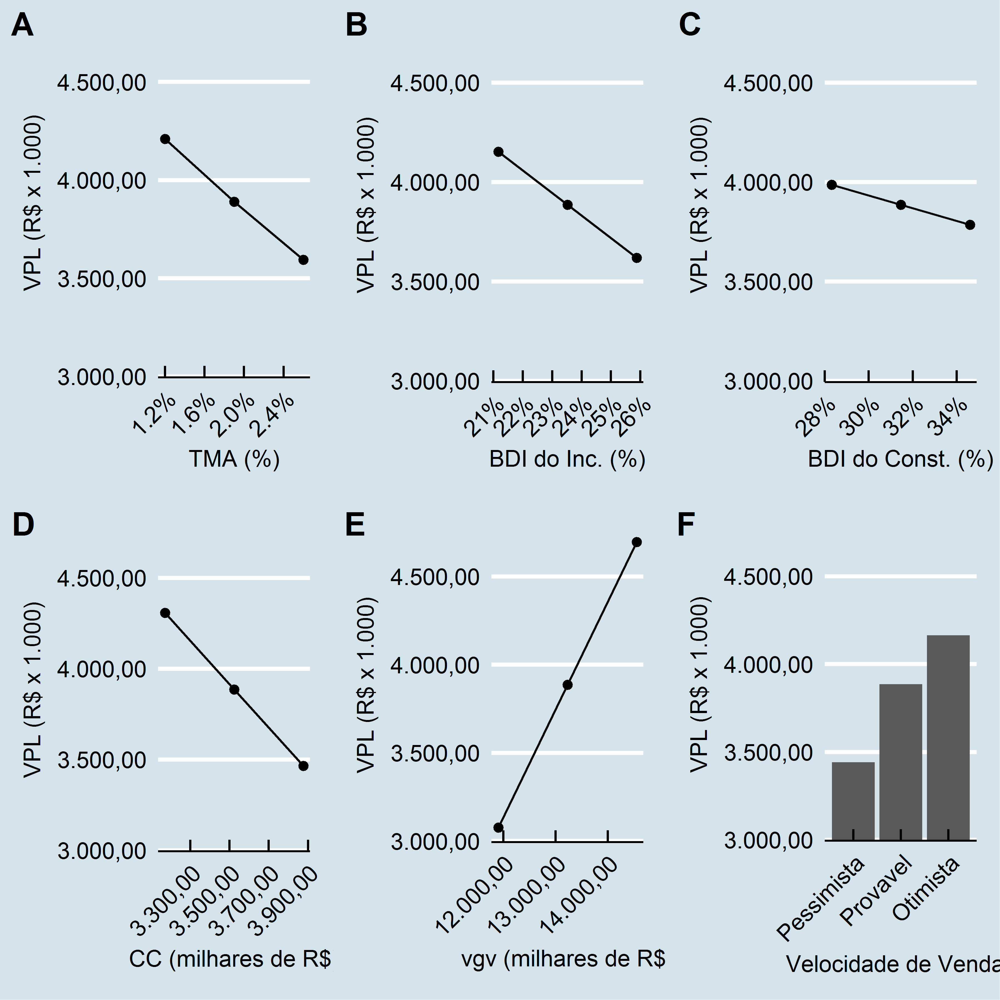
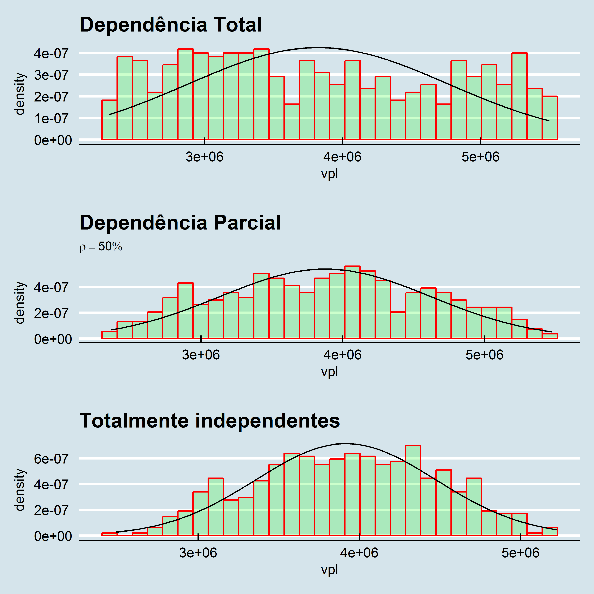
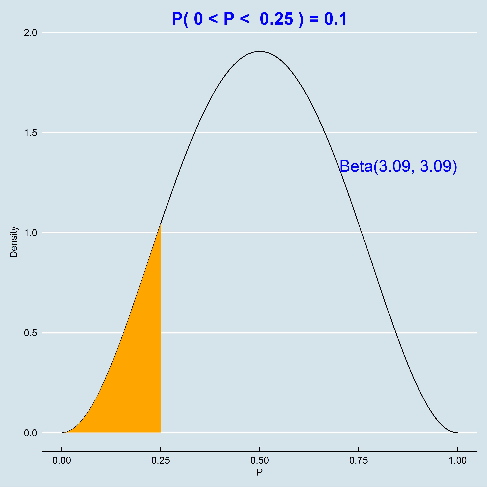
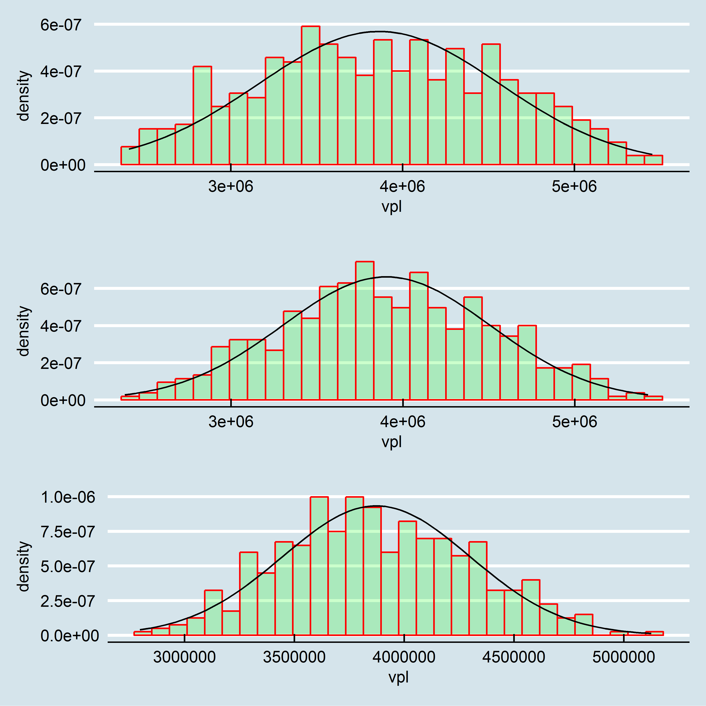
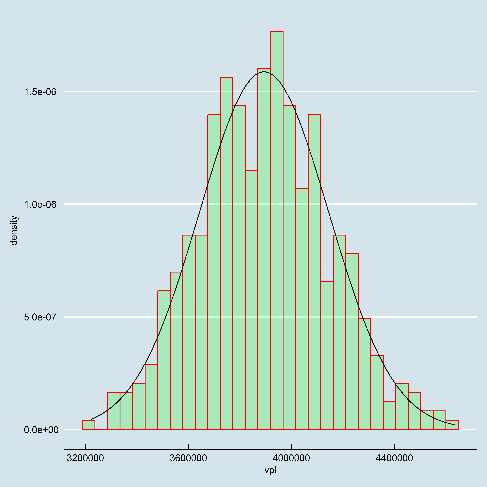

# Avaliação de um lote urbano pelo Método Involutivo Vertical
Luiz Fernando Palin Droubi  
`r format(Sys.time(), '%d/%m/%Y')`  


# Dados preliminares


Trata-se de avaliar pelo método involutivo um terreno com área de 500$m^2$, cujos estudos de mercado indicam que o melhor aproveitamento para este terreno é a construção de um prédio residencial. Considerando-se o máximo aproveitamento possível (o índice de aproveitamento do terreno é 2.5), pode-se construir 20 apartamentos com área total de 75$m^2$ cada um, num prédio de 6 pisos (5 + 1). 

## Previsão de Receitas ou Produto Geral de Vendas (Pgv) e velocidade de vendas

O Produto Geral de Vendas (Pgv) ou Valor Global de Vendas (VGV) é o Produto de vendas total do empreendimento hipotético.

O preço de venda praticado pelo mercado na região do imóvel é de R\$ 7.000,00/$m^2$, o que gera um Pgv de R\$ 10.500.000,00. 

Já o cronograma de venda foi estimado bimestralmente como mostrado abaixo:


--------  ---  ---  ---  ---  ---  ---  ----  ----  ----  ----  ----  ----  ----  ----
Periodo   0    1    2    3    4    5    6     7     8     9     10    11    12    13  
Vendas    0%   0%   5%   5%   5%   5%   10%   10%   10%   10%   10%   10%   10%   10% 
--------  ---  ---  ---  ---  ---  ---  ----  ----  ----  ----  ----  ----  ----  ----

## Custos de Construção e Cronograma Financeiro

Estima-se que o custo de construção seja 120\% do CUB R8N, que no momento é de R\$ 1.553,57/$m^2$, de maneira então que o custo de referência será de R\$ 1.864,28/$m^2$, totalizando R\$ 2.796.426,00. 

O cronograma financeiro da construção foi estimado bimestralmente como mostrado a baixo:


--------  ------  ------  ------  ------  -------  -------  -------  -------  -------  ------
Periodo   0       1       2       3       4        5        6        7        8        9     
Custos    5.67%   6.63%   7.24%   7.55%   10.76%   13.26%   14.72%   13.16%   14.18%   6.84% 
--------  ------  ------  ------  ------  -------  -------  -------  -------  -------  ------

## Taxa mínima de atratividade (TMA)

A taxa mínima de atratividade do empreendimento foi calculada levando em consideração a taxa livre de risco do mercado, atualmente em 1,20\% a.b. e a taxa de risco do empreendimento, adotada 0,70\% a.b., resultando numa TMA de 1,91\% a.b..

# Fluxo de Caixa Provável do Empreendimento

O Fluxo de Caixa do Empreendimento pode ser visto abaixo:


Table: Tabela de Fluxo de Caixa do Emprendimento

 Periodo         FCV          FCI   Corretagem   BDI_Incorporador           FCL   fator_VP   FCL_descontado
--------  ----------  -----------  -----------  -----------------  ------------  ---------  ---------------
       0           0   -208.439,5            0                  0   -208.439,50       1,00      -208.439,50
       1           0   -243.730,8            0                  0   -243.730,84       0,98      -239.166,59
       2     525.000   -266.155,5      -26.250           -123.480    109.114,45       0,96       105.066,03
       3     525.000   -277.551,7      -26.250           -123.480     97.718,29       0,94        92.330,65
       4     525.000   -395.557,1      -26.250           -123.480    -20.287,14       0,93       -18.809,66
       5     525.000   -487.461,7      -26.250           -123.480   -112.191,68       0,91      -102.072,97
       6   1.050.000   -541.133,9      -52.500           -246.960    209.406,07       0,89       186.951,67
       7   1.050.000   -483.785,5      -52.500           -246.960    266.754,50       0,88       233.690,94
       8   1.050.000   -521.282,5      -52.500           -246.960    229.257,45       0,86       197.080,47
       9   1.050.000   -251.450,8      -52.500           -246.960    499.089,18       0,84       421.006,02
      10   1.050.000          0,0      -52.500           -246.960    750.540,00       0,83       621.260,89
      11   1.050.000          0,0      -52.500           -246.960    750.540,00       0,81       609.626,77
      12   1.050.000          0,0      -52.500           -246.960    750.540,00       0,80       598.210,52
      13   1.050.000          0,0      -52.500           -246.960    750.540,00       0,78       587.008,06

# Valor Presente Líquido (VPL) Provável


De acordo com o observado no fluxo de caixa acima, o VPL do empreendimento é a soma da coluna do Fluxo de Caixa Líquido descontado -- da taxa de juros mínima de atratividade, ou seja, o VPL é **R\$ 3.083.743,30**. 

# Análises de Sensibilidade

## Sensibilidade em relação à taxa mínima de atratividade

Em relação à taxa mínima de atratividade (TMA), a consideraremos variando entre o valor mínimo de 1,20\% a.b. para o cenário otimista e o valor máximo de 2,60\% a.b., no cenário pessimista.


Table: Sensibilidade do VPL à variação da TMA

Situacao        TMA         VPL   Variacao
-----------  ------  ----------  ---------
Pessimista    0,026   2.852.118     -0,076
Provavel      0,019   3.086.672      0,000
Otimista      0,012   3.341.070      0,082

## Sensibilidade em relação ao custo de construção do empreendimento

Em relação ao custo do empreendimento, consideraremos uma variação no custo de construção (antes do BDI do construtor) entre 90\% e 110\% do custo provável.


Table: Sensibilidade do VPL à variação do Custo de Construção

Situacao             CC         VPL   Variacao
-----------  ----------  ----------  ---------
Pessimista    2.516.783   3.418.098       0,11
Provavel      2.796.426   3.083.743       0,00
Otimista      3.076.069   2.749.389      -0,11

## Sensibilidade em relação ao BDI do Construtor

Em relação ao BDI do Construtor, consideraremos uma variação entre 90\% e 110\% do BDI provável.


Table: Sensibilidade do VPL à variação do BDI do Construtor

Situacao      BDI_Construtor         VPL   Variacao
-----------  ---------------  ----------  ---------
Pessimista              0,35   3.003.728      -0,03
Provavel                0,31   3.083.743       0,00
Otimista                0,28   3.163.758       0,03

## Sensibilidade em relação ao valor de venda do empreendimento

Em relação às vendas, consideraremos uma variação entre 90\% e 110\% do Pgv provável.


Table: Sensibilidade do VPL à variação do Pgv

      Situacao          Vendas         VPL   Variacao
----  -----------  -----------  ----------  ---------
min   Pessimista     9.450.000   2.441.015      -0,21
      Provavel      10.500.000   3.083.743       0,00
max   Otimista      11.550.000   3.726.472       0,21


## Sensibilidade em relação ao BDI do Incorporador

Em relação ao BDI do Incorporador, consideraremos uma variação entre 90~\% e 110\% do BDI provável.


Table: Sensibilidade do VPL à variação do BDI do Incorporador

Situacao      BDI_Incorporador         VPL   Variacao
-----------  -----------------  ----------  ---------
Pessimista                0,26   2.872.258      -0,07
Provavel                  0,24   3.083.743       0,00
Otimista                  0,21   3.295.229       0,07

## Sensibilidade em relação à velocidade de vendas do empreendimento

Quanto à velocidade de vendas, consideraremos que as vendas podem ser feitas, num cenário pessimista, na seguinte velocidade:


------------- ---- ---- ---- ---- ---- ---- ---- ---- ---- ---- ---- ---- ----
 **Periodo**   0    1    2    3    4    5    6    7    8    9    10   11   12 

 **Vendas**    0%   0%   5%   5%   5%   5%   5%   5%   5%   5%   5%   5%   5% 
------------- ---- ---- ---- ---- ---- ---- ---- ---- ---- ---- ---- ---- ----

Table: Table continues below

 
------------- ---- ---- ---- ---- ---- ---- ---- ---- ----
 **Periodo**   13   14   15   16   17   18   19   20   21 

 **Vendas**    5%   5%   5%   5%   5%   5%   5%   5%   5% 
------------- ---- ---- ---- ---- ---- ---- ---- ---- ----

Já para o cenário otimista em relação à velocidade de vendas, foi considerada a seguinte hipótese:


--------  ---  ---  ----  ----  ----  ----  ----  ----  ----  ----  ----  ----
Periodo   0    1    2     3     4     5     6     7     8     9     10    11  
Vendas    0%   0%   10%   10%   10%   10%   10%   10%   10%   10%   10%   10% 
--------  ---  ---  ----  ----  ----  ----  ----  ----  ----  ----  ----  ----


Table: Sensibilidade do VPL à variação da velocidade de vendas do Empreendimento

Situacao     VV                  VPL   Variacao
-----------  -----------  ----------  ---------
Pessimista   Pessimista    2.731.317      -0,11
Provavel     Provavel      3.083.743       0,00
Otimista     Otimista      3.303.815       0,07

## Análise gráfica de sensibilidade

Na figura abaixo são mostrados os gráficos para as análises de sensibilidade efetuadas acima.



Com os gráficos alinhados, e todos com os mesmos limites de escala em relação ao VPL, é fácil perceber a maior ou menor influência das diferentes variáveis na composição final do VPL.

Nota-se que, para esta análise, a variação do Pgv -- ou melhor, uma variação no valor unitário de venda -- tem um maior impacto

# Análise de Cenários

Foram analisados três cenários: o pessimista, o mais provável e o otimista.

Para cada cenário foi calculado um Fluxo de Caixa de Vendas, um Fluxo de Caixa de Investimentos e um Fluxo de Caixa Líquido, de onde foram obtidos os VPL's para cada cenário.

## Cenário Pessimista

No cenário pessimista, o Fluxo de Caixa de Vendas foi elaborado considerando-se um valor de 90\%  do Pgv Provável, em conjunto com o fluxo de vendas pessimista, como pode ser visto em [Sensibilidade em relação à velocidade de vendas do empreendimento]. Já o Fluxo de Caixa de Investimentos foi calculado considerando-se o valor de 110\% do Custo de Construção Provável e com BDI do Construtor com valor de 110\% do BDI Provável do Construtor. Finalmente, para o Fluxo de Caixa Líquido, foi considerado um valor de 110\% do BDI Provável do Incorporador e uma taxa mínima de atratividade de 2.6\%.


Table: Fluxo de Caixa pessimista do Empreendimento

 Periodo       FCV          FCI   Corretagem   BDI_Incorporador           FCL    fator_VP   FCL_descontado
--------  --------  -----------  -----------  -----------------  ------------  ----------  ---------------
       0         0   -234.770,5            0                0,0   -234.770,48   1,0000000      -234.770,48
       1         0   -274.520,0            0                0,0   -274.519,98   0,9746589      -267.563,34
       2   472.500   -299.777,5      -23.625         -122.245,2     26.852,32   0,9499599        25.508,63
       3   472.500   -312.613,3      -23.625         -122.245,2     14.016,55   0,9258869        12.977,74
       4   472.500   -445.525,6      -23.625         -122.245,2   -118.895,84   0,9024238      -107.294,44
       5   472.500   -549.040,0      -23.625         -122.245,2   -222.410,17   0,8795554      -195.622,06
       6   472.500   -609.492,3      -23.625         -122.245,2   -282.862,53   0,8572665      -242.488,56
       7   472.500   -544.899,4      -23.625         -122.245,2   -218.269,59   0,8355424      -182.373,49
       8   472.500   -587.133,2      -23.625         -122.245,2   -260.503,44   0,8143688      -212.145,87
       9   472.500   -283.215,2      -23.625         -122.245,2     43.414,61   0,7937318        34.459,56
      10   472.500          0,0      -23.625         -122.245,2    326.629,80   0,7736177       252.686,59
      11   472.500          0,0      -23.625         -122.245,2    326.629,80   0,7540133       246.283,23
      12   472.500          0,0      -23.625         -122.245,2    326.629,80   0,7349058       240.042,13
      13   472.500          0,0      -23.625         -122.245,2    326.629,80   0,7162824       233.959,19
      14   472.500          0,0      -23.625         -122.245,2    326.629,80   0,6981310       228.030,40
      15   472.500          0,0      -23.625         -122.245,2    326.629,80   0,6804396       222.251,85
      16   472.500          0,0      -23.625         -122.245,2    326.629,80   0,6631965       216.619,74
      17   472.500          0,0      -23.625         -122.245,2    326.629,80   0,6463904       211.130,35
      18   472.500          0,0      -23.625         -122.245,2    326.629,80   0,6300101       205.780,07
      19   472.500          0,0      -23.625         -122.245,2    326.629,80   0,6140449       200.565,37
      20   472.500          0,0      -23.625         -122.245,2    326.629,80   0,5984843       195.482,82
      21   472.500          0,0      -23.625         -122.245,2    326.629,80   0,5833181       190.529,06

## Cenário Provável

Os resultados para o cenário provável podem ser encontrados em [Fluxo de Caixa Provável do Empreendimento].

## Cenário Otimista

No cenário otimista, o Fluxo de Caixa de Vendas foi elaborado considerando-se um valor de 110\% do Pgv Provável, em conjunto com o fluxo de vendas otimista, como pode ser visto em [Sensibilidade em relação à velocidade de vendas do empreendimento]. Já o Fluxo de Caixa de Investimentos foi calculado considerando-se o valor de 90\% do Custo de Construção Provável e com BDI do Construtor com valor de 90\% do BDI Provável do Construtor. Finalmente, para o Fluxo de Caixa Líquido, foi considerado um valor de 90\% do BDI Provável do Incorporador e uma taxa mínima de atratividade de 1.2\%.


Table: Fluxo de Caixa otimista do Empreendimento

 Periodo         FCV          FCI   Corretagem   BDI_Incorporador          FCL    fator_VP   FCL_descontado
--------  ----------  -----------  -----------  -----------------  -----------  ----------  ---------------
       0           0   -183.106,2            0                0,0   -183.106,2   1,0000000       -183.106,2
       1           0   -214.108,3            0                0,0   -214.108,3   0,9881423       -211.569,4
       2   1.155.000   -233.807,5      -57.750         -244.490,4    618.952,1   0,9764252        604.360,4
       3   1.155.000   -243.818,6      -57.750         -244.490,4    608.941,0   0,9648470        587.534,9
       4   1.155.000   -347.481,9      -57.750         -244.490,4    505.277,7   0,9534062        481.734,9
       5   1.155.000   -428.216,5      -57.750         -244.490,4    424.543,1   0,9421009        399.962,4
       6   1.155.000   -475.365,5      -57.750         -244.490,4    377.394,1   0,9309298        351.327,4
       7   1.155.000   -424.987,1      -57.750         -244.490,4    427.772,5   0,9198911        393.504,1
       8   1.155.000   -457.926,9      -57.750         -244.490,4    394.832,7   0,9089833        358.896,4
       9   1.155.000   -220.890,0      -57.750         -244.490,4    631.869,6   0,8982048        567.548,4
      10   1.155.000          0,0      -57.750         -244.490,4    852.759,6   0,8875542        756.870,3
      11   1.155.000          0,0      -57.750         -244.490,4    852.759,6   0,8770298        747.895,6

## Valor Presente Líquido dos diversos cenários


```r
vpl_pessimista <- sum(FC_pessimista$FCL_descontado)
vpl_otimista <- sum(FC_otimista$FCL_descontado)
```

O VPL para o cenário mais pessimista é de **R\$ 1.274.048,49** e para o cenário mais otimista, de **R\$ 4.854.959,22**.

# Simulações


```r
ranges <- list(vgv = range_Pgv, cc = range_custos, bdi_i = range_bdi_i, bdi_c = range_bdi_c)
variables <- list(vgv = Pgv, wv = wv, cc = cc, wc = wc, bdi_i = bdi_i, bdi_c = bdi_c, cor = cor, tma = tma)
```
## Simulação de Monte Carlo com distribuição uniforme

Foram realizadas 500 simulações com a distribuição uniforme, utilizando-se como variáveis aleatórias o Valor Global de Vendas, o Custo de Construção, o BDI do Construtor e o BDI do Incorporador. As demais variáveis (Velocidade de Vendas, Cronograma de Desembolsos da Construção, Corretagens e Taxa Mínima de Atratividade) foram consideradas fixas, com os valores prováveis já mencionados anteriormente. Foram consideradas três diferentes hipóteses em relação à dependência (ou correlação) entre as variáveis: dependência total, dependência parcial e independência total entre as variáveis aleatórias.

### A distribuição uniforme

A distribuição uniforme é a mais simples distribuição contínua. Tem como característica ter probabilidades de ocorrência igual para todo o intervalo em que ela é definida.

É muito utilizada na inferência Bayesiana como distribuição a priori, quando não se tem motivos ou dados para se acreditar que uma população tenha uma distribuição diferente da uniforme. Como a distribuição uniforme não penaliza nem prioriza quaisquer valores dentro de um intervalo, ela é considerada a melhor distribuição a priori quando não se sabe como uma variável se comporta dentro deste intervalo. Posteriormente, com a realização de pesquisas, pode-se encontrar uma distribuição diferente da uniforme para a distribuição a posteriori.

### Variáveis totalmente dependentes

A simulação da dependência total das variáveis pode ser feita através da construção de uma matriz de correlação como vista abaixo:


         vgv   cc   bdi_i   bdi_c
------  ----  ---  ------  ------
vgv        1   -1      -1      -1
cc        -1    1       1       1
bdi_i     -1    1       1       1
bdi_c     -1    1       1       1


```r
set.seed(1)
vpl_unif100 <- vpl_sim(Nsim, ranges = ranges, variables = variables, 
                       distribution = "uniform", dependencia = dependencia100)
m_unif100 <- mean(vpl_unif100$vpl)
std_unif100 <- sd(vpl_unif100$vpl)
```

Baseados nas 500 simulações, o VPL esperado é igual o valor médio das simulações, ou seja, R\$ 3.102.196,45. 

A probabilidade que o VPL seja inferior a 85\% da média pode ser calculado através do número de simulações com valor abaixo deste valor, dividido pelo número de simulações:


```r
sum(vpl_unif100$vpl < 0.85*mean(vpl_unif100$vpl))/Nsim
```

```
## [1] 0.298
```

Ou teoricamente, através da função densidade de probabilidade normal, com os parâmetros iguais aos da simulação, a saber, média de **3.102.196,45** e desvio padrão **730.583,03**:


```r
pnorm(0.85*mean(vpl_unif100$vpl), mean = mean(vpl_unif100$vpl), sd = sd(vpl_unif100$vpl))
```

```
## [1] 0.2620856
```

### Variáveis parcialmente (50%) dependentes

Para simular a dependência parcial das variáveis foi montada uma matriz de correlação como abaixo:


          vgv     cc   bdi_i   bdi_c
------  -----  -----  ------  ------
vgv       1.0   -0.5    -0.5    -0.5
cc       -0.5    1.0     0.5     0.5
bdi_i    -0.5    0.5     1.0     0.5
bdi_c    -0.5    0.5     0.5     1.0


```r
vpl_unif50 <- vpl_sim(Nsim, ranges = ranges, variables = variables,
                  distribution = "uniform", dependencia = dependencia50)
m_unif50 <- mean(vpl_unif50$vpl)
std_unif50 <- sd(vpl_unif50$vpl)
```

Baseados nas 500 simulações, o VPL esperado é igual o valor médio das simulações, ou seja, R\$ 3.100.348,82. 

A probabilidade que o VPL seja inferior a 85\% da média pode ser calculado através do número de simulações com valor abaixo deste valor, dividido pelo número de simulações:


```r
sum(vpl_unif50$vpl < 0.85*mean(vpl_unif50$vpl))/Nsim
```

```
## [1] 0.27
```

Ou teoricamente, através da função densidade de probabilidade normal, com os parâmetros iguais aos da simulação, a saber, média de **3.100.348,82** e desvio padrão **620.770,07**:


```r
pnorm(0.85*mean(vpl_unif50$vpl), mean = mean(vpl_unif50$vpl), sd = sd(vpl_unif50$vpl))
```

```
## [1] 0.2268822
```

### Variáveis totalmente independentes 

Para a simulação com variáveis totalmente independentes, constrói-se uma matriz diagonal de correlação, como pode ser vista abaixo:


         vgv   cc   bdi_i   bdi_c
------  ----  ---  ------  ------
vgv        1    0       0       0
cc         0    1       0       0
bdi_i      0    0       1       0
bdi_c      0    0       0       1


Baseados nas 500 simulações, o VPL esperado é igual o valor médio das simulações, ou seja, R\$ 3.085.750,63. 

A probabilidade que o VPL seja inferior a 85\% da média pode ser calculado através do número de simulações com valor abaixo deste valor, dividido pelo número de simulações:


```r
sum(vpl_unif$vpl < 0.85*mean(vpl_unif$vpl))/Nsim
```

```
## [1] 0.168
```

Ou teoricamente, através da função densidade de probabilidade normal, com os parâmetros iguais aos da simulação, a saber, média de **3.085.750,63** e desvio padrão **453.049,17**:


```r
pnorm(0.85*mean(vpl_unif$vpl), mean = mean(vpl_unif$vpl), sd = sd(vpl_unif$vpl))
```

```
## [1] 0.1534707
```
### Gráficos




## Simulação de Monte Carlo com distribuição beta

Da mesma maneira explicada na seção anterior, realizamos 500 simulações com a distribuição beta. Neste caso, adotamos como parâmetros da distribuição beta os fatores $\alpha$ e $\beta$ iguais a 2 e 2, respectivamente.

### A distribuição beta

A distribuição beta está definida no intervalo (0,1) e pode assumir diferentes formas dentro deste intervalo, motivo pelo qual a distribuição beta é um modelo conveniente para prever o comportamento aleatório de porcentagens e proporções. Dependendo dos fatores de forma $\alpha$ e $\beta$ adotados. Quando os valor de $\alpha$ e $\beta$ são simultaneamente iguais a 1, a distribuição beta toma a forma da distribuição uniforme no intervalo (0,1). Mas a distribuição beta pode tomar uma variedade de formas para outros valores de $\alpha$ e $\beta$, alguns dos quais podem ser vistos abaixo:


É normalmente utilizada na inferência Bayesiana como distribuição a priori, onde os parâmetros $\alpha$ e $\beta$ são inicialmente estimados e posteriormente atualizados de acordo com os resultados de pesquisas.

Na inferência Bayesiana, os parâmetros podem ser inicialmente estimados de acordo com o conhecimento empírico prévio do especialista. Como exemplo, imagine que um orçamentista deseje testar se o Custo Unitário Básico (CUB) divulgado pelo SINDUSCON/SC para um determinado padrão de construção é uma boa estimativa para o custo médio das obras daquele padrão no seu município. O orçamentista experiente estima que os custos de construção das obras daquele padrão se situem entre 90% e 110% do CUB e, inicialmente, pensa que o CUB é sim um bom estimador dos custos de construção para o seu município, por isto ele prevê que 50% das obras daquele padrão tenham custo de construção menor ou igual ao CUB, enquanto as outras 50% a superem. Ainda, o especialista prevê que, para aquele padrão, apenas 10% das obras tenham custo abaixo de 95% do CUB (ou seja, se encontrem no primeiro quartil).


Isto equivale a dizer que o especialista pode utilizar uma distribuição beta como a mostrada abaixo como uma distribuição a priori do custo das obras no seu município:


```r
beta_area(0, 0.25, c(3.09, 3.09))
```



Posteriormente, o orçamentista realiza uma pesquisa com 20 obras de construtoras locais e verifica que apenas 7 tiveram custo inferior ao CUB. Com estes dados, o especialista deve atualizar a sua distribuição de probabilidade a priori, obtendo uma distribuição a posteriori que se compara com a distribuição a priori da seguinte maneira:


```r
data <- c(13, 7)
post_par <- prior_par + data
beta_prior_post(prior_par, post_par)
```


Este processo pode ser repetido continuamente, com a distribuição a posteriori tornando-se a nova distribuição a priori e realizando-se nova pesquisa.

### Dependência Total


A probabilidade que o VPL seja inferior a 85\% da média pode ser calculado através do número de simulações com valor abaixo deste valor, dividido pelo número de simulações:


```r
sum(vpl_beta2_100$vpl < 0.85*mean(vpl_beta2_100$vpl))/Nsim
```

```
## [1] 0.25
```

Ou teoricamente, através da função densidade de probabilidade normal, com os parâmetros iguais aos da simulação, a saber, média de **3.077.205,99** e desvio padrão **597.366,46**:


```r
pnorm(0.85*mean(vpl_beta2_100$vpl), mean = mean(vpl_beta2_100$vpl), sd = sd(vpl_beta2_100$vpl))
```

```
## [1] 0.219852
```

### Dependência Parcial


A probabilidade que o VPL seja inferior a 85\% da média pode ser calculado através do número de simulações com valor abaixo deste valor, dividido pelo número de simulações:


```r
sum(vpl_beta2_50$vpl < 0.85*mean(vpl_beta2_50$vpl))/Nsim
```

```
## [1] 0.17
```

Ou teoricamente, através da função densidade de probabilidade normal, com os parâmetros iguais aos da simulação, a saber, média de **3.059.310,88** e desvio padrão **472.680,59**:


```r
pnorm(0.85*mean(vpl_beta2_50$vpl), mean = mean(vpl_beta2_50$vpl), sd = sd(vpl_beta2_50$vpl))
```

```
## [1] 0.1658143
```

### Independência Total


A probabilidade que o VPL seja inferior a 85\% da média pode ser calculado através do número de simulações com valor abaixo deste valor, dividido pelo número de simulações:


```r
sum(vpl_beta2$vpl < 0.85*mean(vpl_beta2$vpl))/Nsim
```

```
## [1] 0.082
```

Ou teoricamente, através da função densidade de probabilidade normal, com os parâmetros iguais aos da simulação, a saber, média de **3.074.055,72** e desvio padrão **331.795,68**:


```r
pnorm(0.85*mean(vpl_beta2$vpl), mean = mean(vpl_beta2$vpl), sd = sd(vpl_beta2$vpl))
```

```
## [1] 0.08230455
```
### Gráficos



## Mudança de parâmetros da distribuição beta

No entanto, não há motivos para supor que as variáveis aleatórias assumam uma distribuição beta com os parâmetros descritos na seção anterior.

Para efeito de comparação, abaixo efetuamos outra simulação, desta vez com parâmetros  $\alpha$ e $\beta$ iguais a 7 e 7, respectivamente, com variáveis aleatórias completamente independentes.


A probabilidade que o VPL seja inferior a 85\% da média pode ser calculado através do número de simulações com valor abaixo deste valor, dividido pelo número de simulações:


```r
mean(vpl_beta7$vpl < 0.85*mean(vpl_beta7$vpl))
```

```
## [1] 0.008
```

Ou teoricamente, através da função densidade de probabilidade normal, com os parâmetros iguais aos da simulação, a saber, média de 3.087.321,15 e desvio padrão 190.660,56:


```r
pnorm(0.85*mean(vpl_beta7$vpl), mean = mean(vpl_beta7$vpl), sd = sd(vpl_beta7$vpl))
```

```
## [1] 0.007572054
```




# Estatísticas descritivas


Table: Estatísticas descritivas das diferentes simulações

                    Min.     1st Qu.      Median        Mean     3rd Qu.        Max.
------------  ----------  ----------  ----------  ----------  ----------  ----------
s_unif_100     1.831.574   2.495.988   3.046.537   3.102.196   3.724.635   4.365.294
s_unif_50      1.858.356   2.602.773   3.083.900   3.100.349   3.603.337   4.292.824
s_unif         1.955.262   2.771.433   3.078.778   3.085.751   3.420.606   4.184.927
s_beta2_100    1.876.354   2.613.508   3.048.207   3.077.206   3.542.097   4.347.440
s_beta2_50     1.969.125   2.725.677   3.044.328   3.059.311   3.394.217   4.279.153
s_beta2        2.165.165   2.843.665   3.082.596   3.074.056   3.312.741   3.928.903
s_beta7        2.532.903   2.950.426   3.090.645   3.087.321   3.216.340   3.632.641


Table: Resumo das médias e desvios

Distribuição   Dependência           Média   Desvio_Padrão
-------------  ---------------  ----------  --------------
Uniforme       Total             3.102.196       730.583,0
Uniforme       Parcial (50\%)    3.100.349       620.770,1
Uniforme       Independente      3.085.751       453.049,2
Beta           Total             3.077.206       597.366,5
Beta           Parcial (50\%)    3.059.311       472.680,6
Beta           Independente      3.074.056       331.795,7
Beta           Independente      3.087.321       190.660,6


# Conclusão

Como notamos nas últimas seções, o valor médio das simulações pouco se altera com a mudança das distribuições adotadas. No entanto, o desvio-padrão das simulações é alterado drasticamente com a mudança da distribuição ou dos parâmetros adotados para elas.

Pesquisas devem ser feitas no sentido de estimar parâmetros mais precisos de distribuição das variáveis envolvidas.
